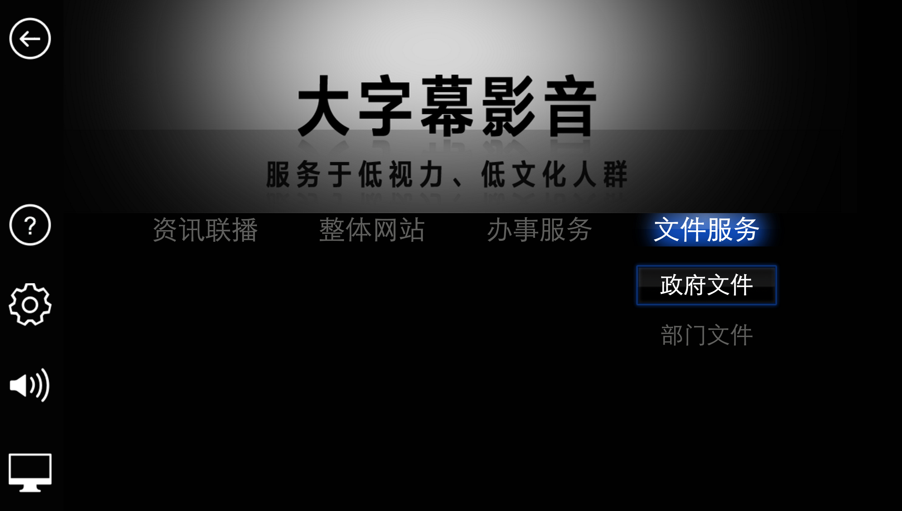

信息无障碍平台产品
---------------
> 平台产品由PC端：大字幕影音服务，移动端：手机网页版，手机影院版，电视端：电视影院服务组合而成，目前建成PC端和移动端1.0产品。本篇讲向您介绍大字幕影音服务。

兼容性
=====

下面的浏览器是已经经过测试的可以兼容，当然其实际支持的范围可能比下面列出的更大， 但是限于时间和资源我无法一一测试，如果您在使用过程中发现可以兼容其他浏览器欢迎告诉我。

- IE 8+ ............ ✔

- Firefox 4+ ....... ✔

- Chrome 34+ ....... ✔

大字幕影音的正确打开方式
====================

```
git clone https://github.com/babyshamble/media.git

```
- 将 media 目录移动到您的www目录下，直接打开media/。

- 如果一切顺利，您将看到如下页面。 
	
